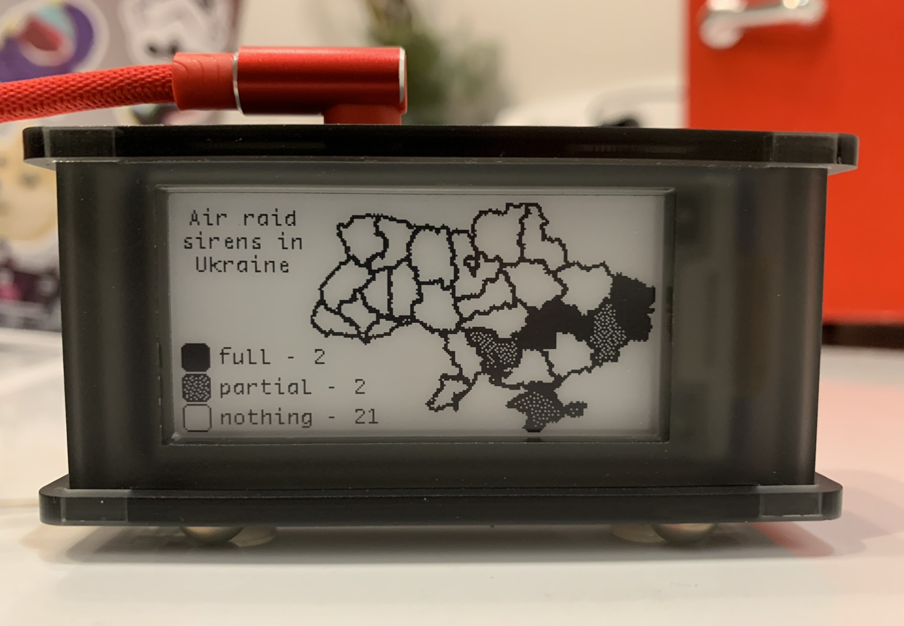

# Air-raid Monitor

Shows active air-raid sirens in Ukraine.



### Bill of materials

* Raspberry Pi Zero W
* Waveshare eInk 2.13
* microSD
* micro-usb cable for power

### Installation

1. Turn on SPI via `sudo raspi-config`
    ```
    Interfacing Options -> SPI
   ```
2. Install dependencies
    ```
    sudo apt update
    sudo apt-get install python3-pip python3-pil python3-numpy python3-lxml git 
    pip3 install RPi.GPIO spidev svglib
    git clone https://github.com/waveshare/e-Paper.git ~/e-Paper
    pip3 install ~/e-Paper/RaspberryPi_JetsonNano/python/
    ```
3. Clone Air-raid Monitor
    ```
    git clone https://github.com/dr-mod/air-raid-monitor.git ~/air-raid-monitor
    ```
6. Run the application
    ```
    python3 ~/air-raid-monitor/main.py
    ```

### Autostart

1. `sudo apt-get install screen`
2. `sudo nano /etc/rc.local`
3. Add the line number 4 before `exit 0`
4. `su - pi -c "/usr/bin/screen -dm sh -c '/usr/bin/python3 /home/pi/air-raid-monitor/main.py'"`